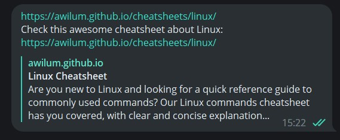
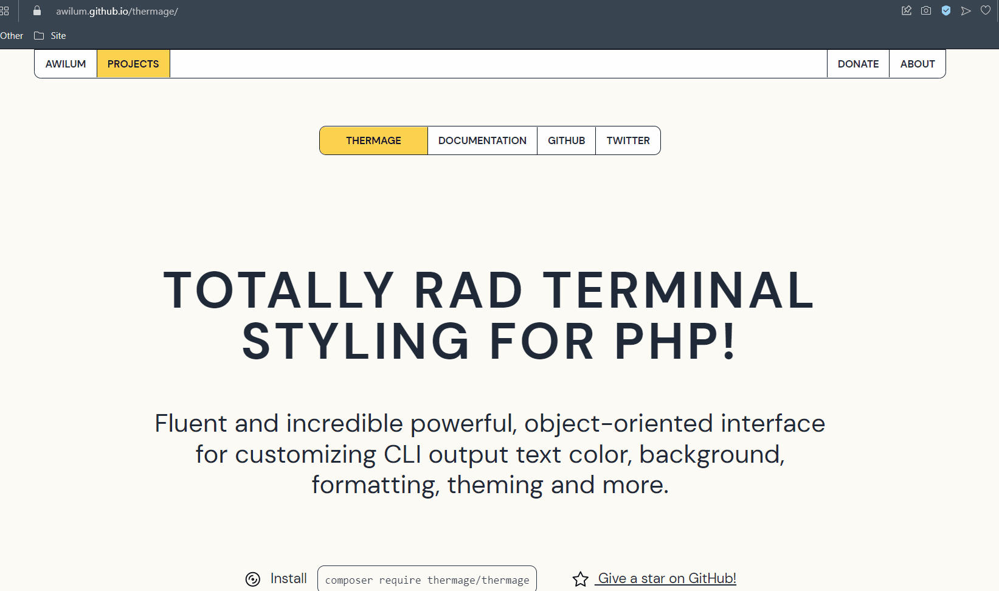
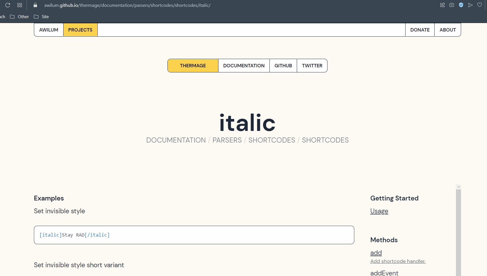
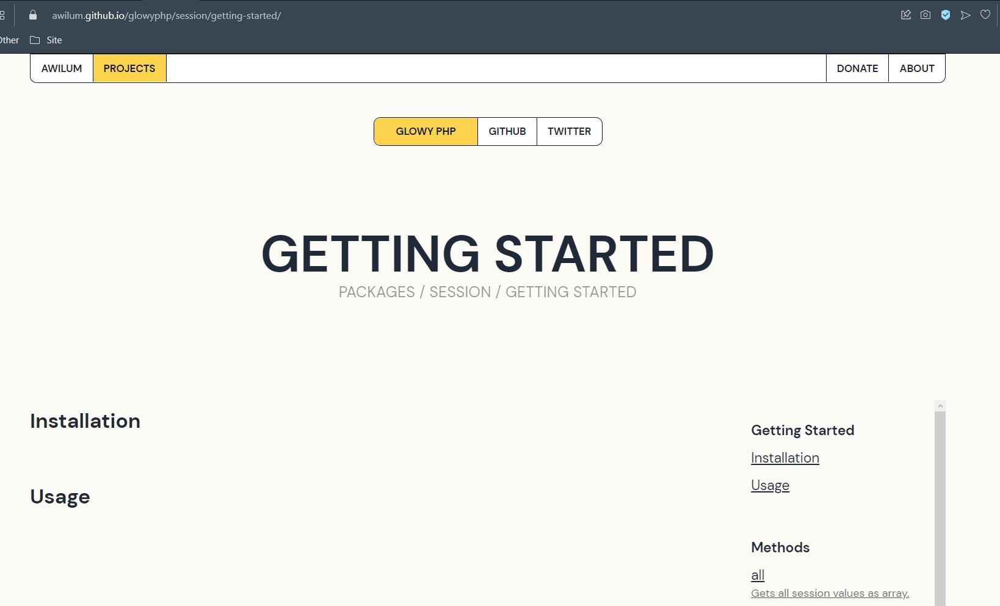
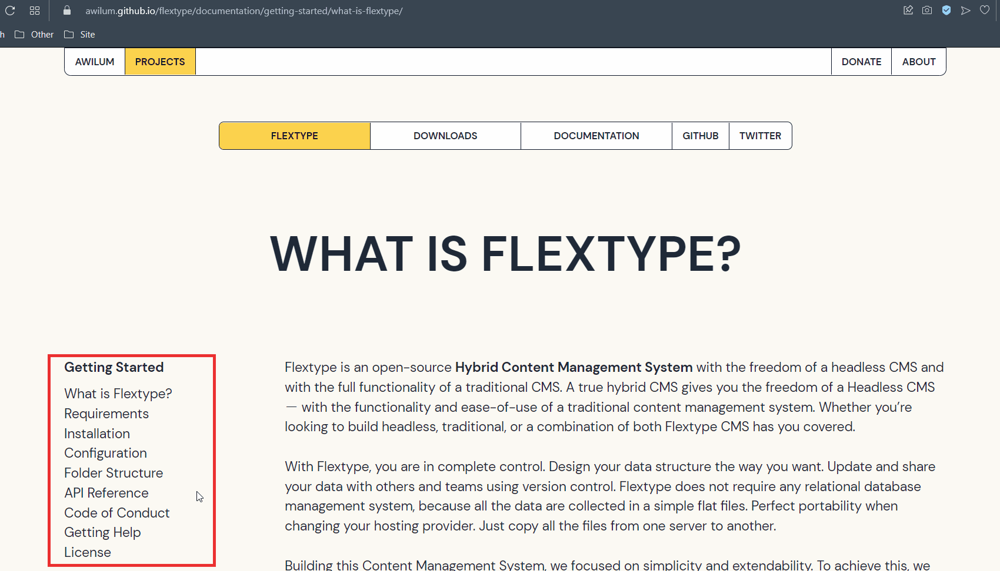
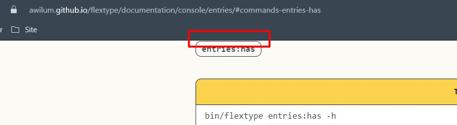

<h1> Исследовательское тестирование </h1>
 Результаты проведения исследовательского тестирования по турам Дж.Уитаккера портала о разработке программного обеспечения от @Awilum (https://awilum.github.io).

<h2>О тестируемом проекте</h2>

<h2>Какие туры выбраны и почему</h2>

Для тестирования выбраны 3 тура:

Тур супермодели - для поверхностного просмотра структуры сайта, интерфейса.  

Тур сборщика мусора - для проверки перехода по внутренней структуре проектов, представленных на портале. Проекты содержат большое количеств страниц, выжно пройти основные.быстрый переход по подразделам каждого из проектов к загрузке проектов. Поскольку проект содержит проекты со множиством вкладок, для проверки возможности 

Тур по ориентирам - для детального рассмотрения связей в документации проекта flextype.

<h3>Тур супермодели</h3>

Цель тура: проверить как выглядит портал и какое первое впечатление производит.

Окружение:  оpera v. 93.0.4585.37

  <table style='width:100%' >
    <thead>
      <tr align='center'>
        <th >Что успели протестировать?</th>
        <th>На что обратили внимание?</th>
        <th>Приложения</th>
      </tr>
    </thead>
    <tr align='justify'>
      <td>Главная страница сайта</td>
      <td align='justify'>Возможен переход по ссылкам рядом с заголовками к таким разделам сайта, как информация об авторе и проектах. В разделе opensource contributions не отображается изображение (рис.1)</td>
      <td align='centrer'>
Рис.1
</td>
    </tr>
     <tr align='justify'>
      <td>Меню</td>
      <td>Выделен активный раздел сайта. Разделы подсвечиваются при наведении на них курсора. При изменении раздела, подсвечивается выбранный раздел сайта.</td>
      <td></td>
    </tr>
    <tr align='justify'>
      <td>Вкладка проекты</td>
      <td rowspan="">
      
Переход по ссылкам к старницам с подробной информацией о проектах. Есть ссылки, ведущие на внешние сайты с информацией о проектах, заменяя вкладку сайта. <b>Предложение по улучшению:</b> если ссылка ведет на внешний сайт, сделать открытие в новом окне.

      
Проект Master Blocks: форматирование загаловка отличается от заголовков в других проектах.

      
Проект Chetlist: в области. Также представлена возможность поделится чит-листом по ссылкам. Не очевидно,для чего эти ссылки. <b>Предложение по улучшению:</b> добавить подсказку для поьзователя, напремер "Share chit-lists on". <b>Возможный баг:</b> при отправлении ссылки в телеграм дублируется адрес сайта (рис.2).

      
Проект Thermage: большое расстояние между загаловками. Выделяется пустое простраство в блоках features. Также при переключении между разделами не выделяется открытый элемент (рис.3).<b> Предложение по улучшению:</b> добавить выделение открытого элемента.

      
На странице с проектами Flextype и Glowy PHP при наведении на разделы идет посветка. При выборе разделов, посвеченным остается первый раздел (рис.4). <b>Предложение по улучшению:</b> добавить выделение открытого элемента
</td>
      <td>
Рис.2
 
Рис.3

Рис.4
</td> 
    </tr>
    <tr align='justify'>
      <td  align='center'>Переход по ссылкам</td>
      <td >При переходе по ссылкам сраницы с кодом ответа 404 File not found: ссылка "Elements", "Shortcodes API",  "and more ..." </td>
      <td></td>
    </tr>
    <tr align='center'>
      <td colspan="5">Затраченное время: 40 мин</td>
    </tr>
  </table>
  
  Ссылка на баг-репорты:
  <a href="https://github.com/Awilum/dev/issues/32">Internal Server Error: the image isn't displayed on main page</a>
  <a href="https://github.com/Awilum/dev/issues/30">404 File not found clicking on the link "Elements" in the feature "Component system" of the project "Thermage"</a>
  <a href="https://github.com/Awilum/dev/issues/31">404 File not found clicking on the link "Shortcodes API" in the feature "Shortcodes" of the project "Thermage"</a>
  <a href="https://github.com/Awilum/dev/issues/34">Two identical links to the cheat sheet in the Telegram message </a>

  Ссылка на предложенные улучшения:

<h3>Тур сборщика мусора (The garbsge collection tour)</h3>

Цель тура: не останавливаясь для детального тестирования в проектах дойти

Окружение:  оpera v. 93.0.4585.37

<table style='width:100%'>
    <thead>
        <tr align='center'>
        <th >Что успели протестировать?</th>
        <th>На что обратили внимание?</th>
        <th>Приложения</th>
        </tr>
    </thead>
    <tr align='justify'>
        <td rowspan="2" align='center'>Проект Cheatsheets </td>
        <td><b>Возможный баг:</b> в пути под заголовком раздела с чит-листом по Linux не активна ссылка возвращения к общей странице раздела Cheetlist. Можно предположить, что она должна быть активна - так как в ранее расмотренных разделах под заголовком подраздела нахотся путь </td>
        <td></td>
    </tr>
        <tr align='justify'>
        <td >Заголовки блоков названия команд ссылаются на самих себя. <b> Предложение по улучшению:</b>убрать ссылки из заголовка блоков, или добавить перед блоками команд список всех команд, с сылками на аналогичные блоки ниже</td>
        <td></td> 
      </tr> 
    <tr align='justify'>
        <td align='center'>Проект Thermage </td>
        <td>Во вкладке Shortcodes сначала идет пример использования и методы и только после страница с шорткодами. При переходе к странице одного из шорт кодов обратила внимание на дубликат страницы Shortcodes, содержащей только список шорткодов. <b> Предложение по улучшению: </b>перенести таблицу шорткодов в начало страницы, убрать дублирующуюся. Также возможный баг в оставлении страницы в пути (рис.)</td>
        <td>
Рис.
</td>
    </tr>
     <tr align='justify'>
        <td align='center'>Проект Flextype</td>
        <td>Объект типа ссылка без добавленной ссылки (рис.). Также обращает на себя внимание меньший межстрочный интервал перечисления в сравнении с основным текстом</td>
        <td align='centrer'>
Рис.
</td>
    </tr>
    <tr align='justify'>
        <td align='center'>Проект Glowy PHP</td>
        <td>Переход к компаненту сисетмы из общей вкладки проекта. При прохождении на вкладки установки, обратила внимание на путь. В меню пункт начала использования не  является отдельным разделом, нажав в пути на этот раздел открылась страница с двумя заголовками ( рис. )</td>
        <td align='centrer'>
Рис.
</td>
    </tr>
  <tr align='center'>
    <td colspan="5">Затраченное время: 30 мин</td>
  </tr>
</table>

Ссылка на баг-репорты:
<a href="https://github.com/Awilum/dev/issues/25">404 File not found clicking on the link "sharing" in the list on the page "View" of the project "Glowy PHP"</a>

Ссылка на предложенные улучшения:

<h3>Тур по ориентирам</h3>

Цель тура: в проекте проверить функции, которые не главные, но находятся рядом с ними пройтись по документации ради ссылок

ориентир - пройти по документации, проверяя ссылки
Время 30 мин

Окружение:  оpera v. 93.0.4585.37

<table style='width:100%'>
  <thead>
    <tr align='centrer' >
      <th >Что успели протестировать?</th>
      <th>На что обратили внимание?</th>
      <th>Приложения</th>
    </tr>
  </thead>
    <tr align='justify'>
        <td align='center'>Переход к документации </td>
        <td>При переключении между разделами, выделенным остается проект.Возможно стоит выделить каким либо цветом раздел, в котором находится пользователь, или перевести выделение на раздел в котором находится пользователь</td>
        <td></td>
    </tr>
    <tr align='justify'>
        <td rowspan="3" align='center'>Перемещение по разделам</td>
        <td>В боковом меню не выбранный раздел. Для навигации по разделам, было бы  удобно увидеть, какая вкладка из меню открыта.</td>
        <td align='centrer'>
Рис.
</td>
    </tr>
    <tr align='justify'>
        <td>При перемещении в длинных разделах долго прокручивать в начало страницы. Было бы удобно довать кнопку перемещения к началу страницы </td>
        <td></td>
    </tr>
        <tr align='justify'>
        <td>Пустая страница Query (рис.)</td>
        <td align='centrer'>
Рис.
</td>
    </tr>
    <tr align='justify'>
        <td align='center'>Расположение элементов на странице</td>
        <td >В getting help дана ссылка на общий проект. Возможно стоит обозначить, что это ссылка на общий проект, или разместить ссылку в заголовке</td>
        <td align='centrer'>
Рис.
</td>
    </tr>
    <tr align='justify'>
        <td  rowspan="2" align='center'>Ссылки в документации Flextype </td>
        <td>Битая ссылка во вкладке Requirements</td>
        <td></td>
    </tr>
    <tr align='justify'>
        <td >В getting help дана ссылка на общий проект. Возможно стоит обозначить, что это ссылка на общий проект, или разместить ссылку в заголовке</td>
        <td></td>
    </tr>
    <tr align='center'>
      <td colspan="3">Затраченное время: 30 мин</td>
    </tr>
</table>

Ссылка на баг-репорты:
<a href="https://github.com/Awilum/dev/issues/34">404 File not found clicking on the link "MAMP" in the "Thermage" documentation point "Requirements"</a>

Ссылка на предложенные улучшения:

